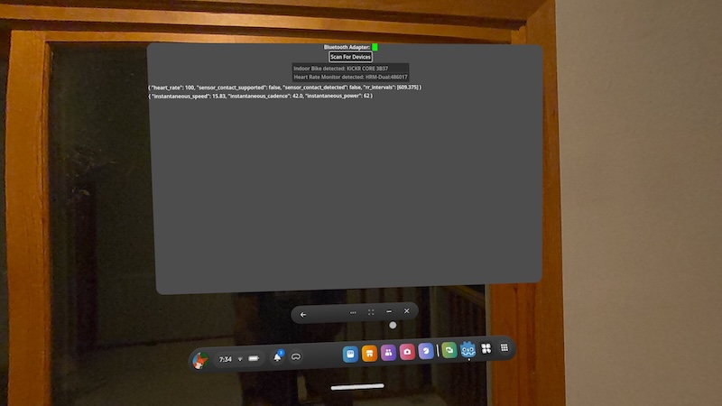

# VELO-G

This was a VR game concept I was experimenting with around fall of 2025.  It is a anti-gravity cycle racing game that interfaced with an indoor bike trainer (Wahoo).

  *There is not a complete game in any of the directories, just experiments with each of the concepts to make this game.*

The code is messy, but I'm posting this to help provide some direction to anyone who wants to make a VR game in Godot that connects to a Bluetooth fitness device, or wants to experiment with HMD controlled movement. Developing an android bluetooth module that works on the Meta Quest 3 and sends fitness protocol data to Godot was challenging to say the least. There are also experiments with both hovercraft and motorcycle based physics.
